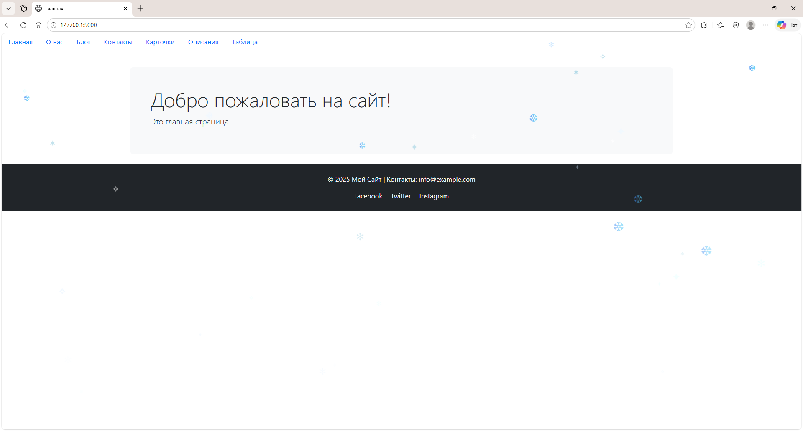
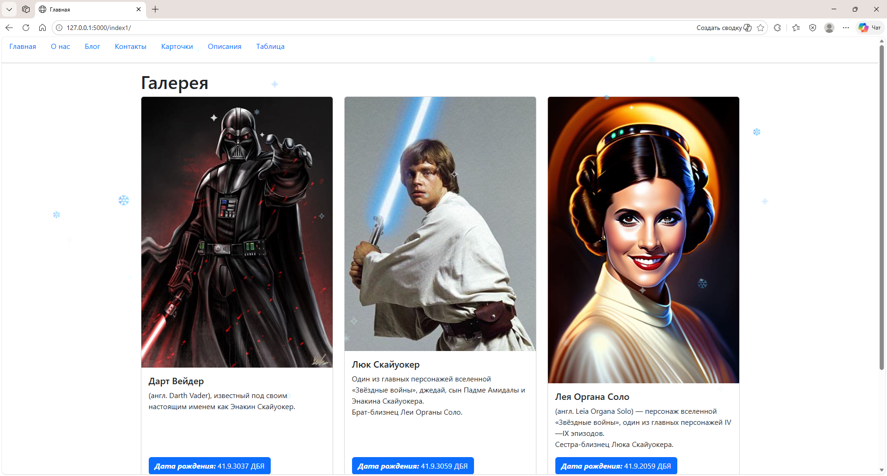
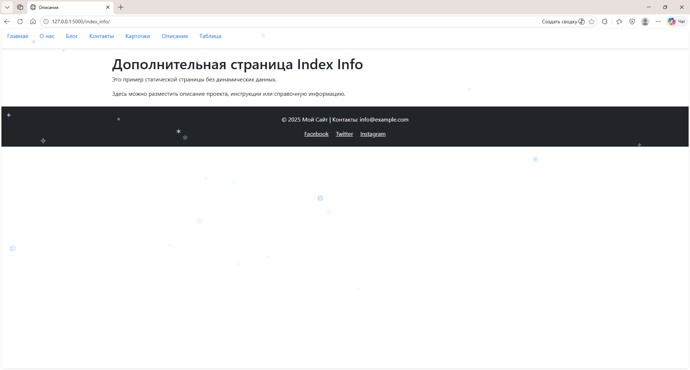
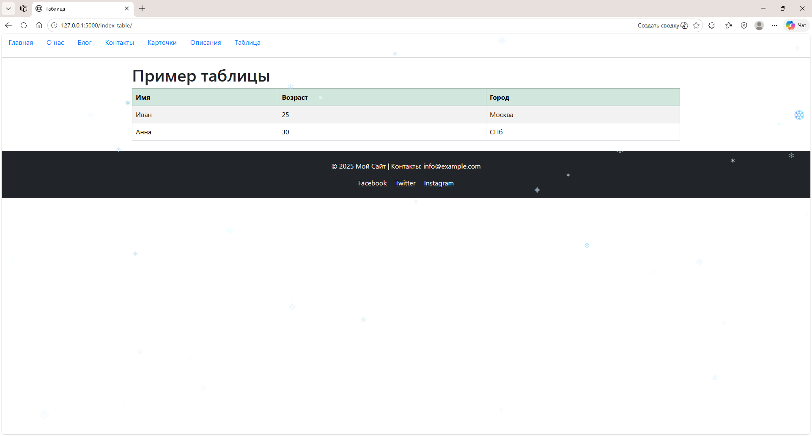

# VD05-Template-engine-and-HTML-templates

Учебный проект на **Flask** с использованием HTML-шаблонов, Bootstrap и кастомного CSS.  
Реализованы страницы с меню, карточками персонажей, анимацией снежинок и современным футером.

---

## 🚀 Возможности проекта
- Использование **Flask** и шаблонов Jinja2 (`base.html` + дочерние страницы).
- Подключение **Bootstrap 5** для адаптивной верстки.
- Секция с карточками персонажей (пример: Дарт Вейдер, Люк Скайуокер, Лея Органа).
- Анимация **снежинок**, падающих сверху экрана с эффектом глубины и покачивания.
- Современный **футер** с контактами и ссылками на соцсети.
- Навигационное меню для перехода между страницами.

---

## 📂 Структура проекта
```
VD05-Template-engine-and-HTML-templates/
├── main.py                 # Flask-приложение
├── README.md     
├── templates/             # HTML-шаблоны
│   ├── base.html
│   ├── home.html
│   ├── about.html
│   ├── blog.html
│   ├── contacts.html
│   ├── index1.html         # карточки
│   ├── index_info.html
│   └── index_table.html
└── static/
├── css/
│   └── style.css       # стили снежинок, карточек, футера
└── image/             # изображения персонажей
├── Дарт Вейдер.jfif
├── Люк Скайуокер.jfif
└── ЛеяОрганаСоло.jfif
```
---

## ⚙️ Установка и запуск

1. Клонировать репозиторий:
   ```bash
   git clone <ссылка-на-репозиторий>
   cd VD05-Template-engine-and-HTML-templates

2. Установить зависимости:  

    pip install flask

3. Запустить приложение:

    pip install flask

4. Открыть в браузере:

    http://127.0.0.1:5000

---

🎨 Скриншоты

## 📸 Скриншоты

### Главная страница и карточки

| Главная страница | Секция карточек персонажей |
|------------------|----------------------------|
|  |  |

---

### Дополнительно

| Описания | Таблица |
|----------|---------|
|  |  |

---

🛠️ Технологии

Python 3 + Flask
HTML5 + Jinja2
CSS3 + Bootstrap 5
Анимации на чистом CSS и JS

---

📧 Контакты
Автор: Владимир
Email: vladtma@tutamail.com

